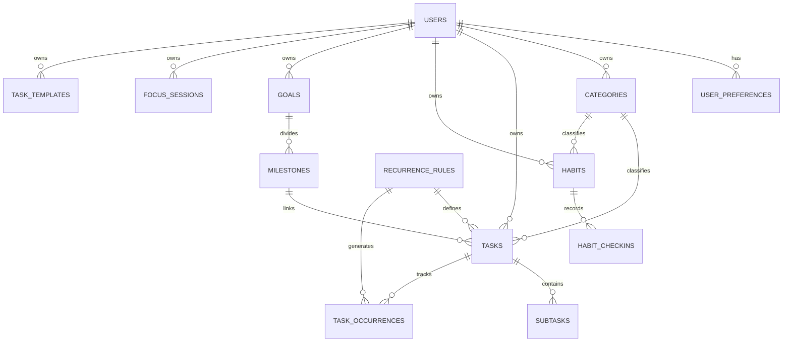

# Daily Consistency Tracker — System Architecture & Domain Model

## 1. Executive Overview

**Daily Consistency Tracker** is a production-quality full-stack productivity platform designed to help users:
**Plan → Schedule → Execute → Track → Analyze → Improve**.

This document serves as the authoritative architectural record, detailing database schemas, state management, recurrence logic, consistency score math, and integration points.

---

## 2. Branding & Modular Isolation

All user-facing application names, logos, taglines, and metadata are centralized in `@/lib/config/site.ts`.
To rebrand the platform:
- Update `siteConfig.name`
- Update `siteConfig.description`
- Replace logo icons in `@/components/layout/BrandLogo.tsx`

---

## 3. Tech Stack Specification

| Layer | Technology | Purpose |
|---|---|---|
| **Framework** | Next.js 14+ (App Router) | Server-side rendering, API routes, Server Actions |
| **Language** | TypeScript (Strict) | End-to-end type safety |
| **Styling** | Tailwind CSS v4 + Radix UI | Modern, accessible, dark/light theme UI system |
| **Icons** | Lucide React | Consistent vector iconography |
| **Database** | PostgreSQL / Supabase | Relational data persistence & RLS security |
| **Auth** | Supabase Auth (`@supabase/ssr`) | Secure sessions, email/password & OAuth |
| **Forms/Validation**| React Hook Form + Zod | Schema validation & typed form state |
| **Charts** | Recharts | Interactive productivity analytics |
| **Dates/Time** | `date-fns` & `date-fns-tz` | Reliable timezone handling & date operations |

---

## 4. Domain & Data Schema (Entity-Relationship)

### Core Entities & Relationships

### Entity Specifications

#### 1. `users` & `user_preferences`
- **`users`**: Extends Supabase `auth.users`.
  - `id`: UUID (PK)
  - `email`: Text
  - `full_name`: Text
  - `avatar_url`: Text
  - `created_at`: Timestamp TZ
- **`user_preferences`**:
  - `user_id`: UUID (FK -> users.id)
  - `timezone`: Text (Default: `'UTC'`)
  - `working_hours_start`: Text (e.g., `'09:00'`)
  - `working_hours_end`: Text (e.g., `'17:00'`)
  - `time_format`: `'12H'` | `'24H'`
  - `week_start`: `'SUNDAY'` | `'MONDAY'`
  - `theme`: `'LIGHT'` | `'DARK'` | `'SYSTEM'`
  - `gamification_enabled`: Boolean (Default: `true`)
  - `pomodoro_work_minutes`: Integer (Default: `25`)
  - `pomodoro_short_break_minutes`: Integer (Default: `5`)
  - `pomodoro_long_break_minutes`: Integer (Default: `15`)

#### 2. `tasks`, `recurrence_rules`, & `task_occurrences`
- **`tasks`**:
  - `id`: UUID (PK)
  - `user_id`: UUID (FK -> users.id)
  - `category_id`: UUID (FK -> categories.id, Nullable)
  - `title`: Text
  - `description`: Text
  - `date`: Date (YYYY-MM-DD)
  - `start_time`: Time (HH:MM, Nullable)
  - `end_time`: Time (HH:MM, Nullable)
  - `duration_minutes`: Integer
  - `is_all_day`: Boolean
  - `priority`: `'LOW'` | `'MEDIUM'` | `'HIGH'` | `'URGENT'`
  - `status`: `'TODO'` | `'IN_PROGRESS'` | `'COMPLETED'` | `'SKIPPED'` | `'MISSED'` | `'RESCHEDULED'`
  - `recurrence_rule_id`: UUID (FK -> recurrence_rules.id, Nullable)
  - `milestone_id`: UUID (FK -> milestones.id, Nullable)
  - `location`: Text
  - `url`: Text
  - `created_at`, `updated_at`: Timestamp TZ
- **`recurrence_rules`**:
  - `id`: UUID (PK)
  - `user_id`: UUID (FK -> users.id)
  - `frequency`: `'DAILY'` | `'WEEKLY'` | `'MONTHLY'` | `'CUSTOM'`
  - `interval`: Integer (Default: `1`)
  - `days_of_week`: SmallInt[] (e.g., `[1,3,5]` for Mon/Wed/Fri)
  - `day_of_month`: Integer (Nullable)
  - `start_date`: Date
  - `end_date`: Date (Nullable)
  - `occurrence_count`: Integer (Nullable)
- **`task_occurrences`**:
  - `id`: UUID (PK)
  - `recurrence_rule_id`: UUID (FK -> recurrence_rules.id)
  - `task_id`: UUID (FK -> tasks.id)
  - `user_id`: UUID (FK -> users.id)
  - `original_date`: Date
  - `status`: `'TODO'` | `'COMPLETED'` | `'SKIPPED'` | `'MISSED'` | `'RESCHEDULED'`
  - `completed_at`: Timestamp TZ
  - `notes`: Text

#### 3. `habits` & `habit_checkins`
- **`habits`**:
  - `id`: UUID (PK)
  - `user_id`: UUID (FK -> users.id)
  - `category_id`: UUID (FK -> categories.id, Nullable)
  - `name`: Text
  - `description`: Text
  - `type`: `'YES_NO'` | `'QUANTITY'` | `'DURATION'`
  - `target_value`: Numeric (Default: `1`)
  - `target_unit`: Text (e.g., `'pages'`, `'minutes'`, `'liters'`)
  - `frequency`: `'DAILY'` | `'WEEKLY'`
  - `preferred_time`: Time (Nullable)
  - `start_date`: Date
  - `is_archived`: Boolean (Default: `false`)
- **`habit_checkins`**:
  - `id`: UUID (PK)
  - `habit_id`: UUID (FK -> habits.id)
  - `user_id`: UUID (FK -> users.id)
  - `date`: Date
  - `value`: Numeric
  - `is_completed`: Boolean
  - `notes`: Text

#### 4. `goals` & `milestones`
- **`goals`**:
  - `id`: UUID (PK)
  - `user_id`: UUID (FK -> users.id)
  - `category_id`: UUID (FK -> categories.id, Nullable)
  - `title`: Text
  - `description`: Text
  - `start_date`: Date
  - `target_date`: Date
  - `status`: `'NOT_STARTED'` | `'IN_PROGRESS'` | `'COMPLETED'` | `'ON_HOLD'`
  - `progress_percentage`: Numeric (0-100)
- **`milestones`**:
  - `id`: UUID (PK)
  - `goal_id`: UUID (FK -> goals.id)
  - `title`: Text
  - `target_date`: Date
  - `is_completed`: Boolean
  - `order_index`: Integer

#### 5. `focus_sessions`
- `id`: UUID (PK)
- `user_id`: UUID (FK -> users.id)
- `task_id`: UUID (FK -> tasks.id, Nullable)
- `planned_duration_minutes`: Integer
- `actual_duration_minutes`: Integer
- `started_at`: Timestamp TZ
- `ended_at`: Timestamp TZ
- `status`: `'COMPLETED'` | `'INTERRUPTED'` | `'ABANDONED'`

---

## 5. Consistency Score Math Engine

The Daily Consistency Score ranges from **0 to 100** and is calculated daily based on weighted productivity factors:

$$\text{Consistency Score} = (0.50 \times C_{\text{tasks}}) + (0.25 \times C_{\text{habits}}) + (0.15 \times C_{\text{on-time}}) + (0.10 \times C_{\text{focus}})$$

Where:
- $C_{\text{tasks}} = \frac{\text{Tasks Completed}}{\text{Total Scheduled Tasks}}$ (100% if no tasks scheduled)
- $C_{\text{habits}} = \frac{\text{Habits Checked In}}{\text{Total Active Habits}}$ (100% if no habits active)
- $C_{\text{on-time}} = \frac{\text{Tasks Completed Before Start/End Window}}{\text{Total Completed Tasks}}$
- $C_{\text{focus}} = \min\left(1.0, \frac{\text{Focus Minutes Logged}}{\text{Planned Focus Minutes (or 50 mins default)}}\right)$

---

## 6. Security Architecture

1. **Row Level Security (RLS)**: Enforced on all tables via `user_id = auth.uid()`.
2. **Server-Side Authorization**: Route Handlers and Server Actions validate session tokens before mutating database records.
3. **Strict Validation**: All API inputs are parsed against strict `zod` schemas.
4. **Environment Variables**: API keys and database credentials are stored in `.env.local` and never committed to source repositories.
