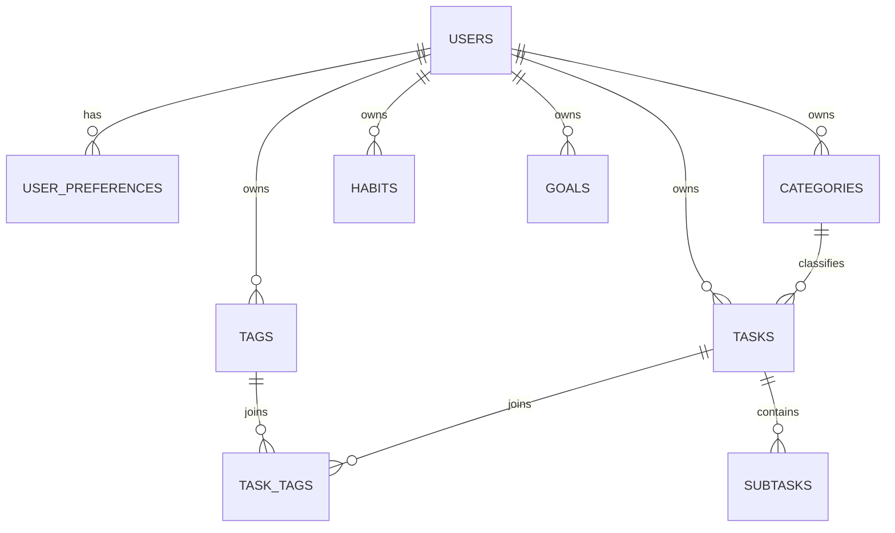

# Daily Consistency Tracker — System Architecture & Domain Model

## 1. Executive Overview

**Daily Consistency Tracker** is a production-quality full-stack productivity platform designed to help users:
**Plan → Schedule → Execute → Track → Analyze → Improve**.

This document serves as the authoritative architectural record, detailing database schemas, state management, recurrence logic, consistency score math, and integration points.

---

## 2. Branding & Modular Isolation

All user-facing application names, logos, taglines, and metadata are centralized in `@/lib/config/site.ts`.
To rebrand the platform:
- Update `siteConfig.name`
- Update `siteConfig.description`
- Replace logo icons in `@/components/layout/BrandLogo.tsx`

---

## 3. Tech Stack Specification

| Layer | Technology | Purpose |
|---|---|---|
| **Framework** | Next.js 14+ (App Router) | Server-side rendering, API routes, Server Actions |
| **Language** | TypeScript (Strict) | End-to-end type safety |
| **Styling** | Tailwind CSS v4 + Radix UI | Modern, accessible, dark/light theme UI system |
| **Icons** | Lucide React | Consistent vector iconography |
| **Database** | PostgreSQL / Supabase | Relational data persistence & RLS security |
| **Auth** | Supabase Auth (`@supabase/ssr`) | Secure sessions, email/password & OAuth |
| **Forms/Validation**| React Hook Form + Zod | Schema validation & typed form state |
| **Charts** | Recharts | Interactive productivity analytics |
| **Dates/Time** | `date-fns` & `date-fns-tz` | Reliable timezone handling & date operations |

---

## 4. Domain & Data Schema (Entity-Relationship)

### Core Entities & Relationships

### Phase 3 Migrations & RLS Policies

#### 1. `categories` Table
- `id`: UUID (PK, DEFAULT `gen_random_uuid()`)
- `user_id`: UUID NOT NULL REFERENCES `auth.users(id)` ON DELETE CASCADE
- `name`: TEXT NOT NULL
- `color`: TEXT NOT NULL DEFAULT `'#6366f1'`
- `icon`: TEXT DEFAULT `'Folder'`
- `is_default`: BOOLEAN NOT NULL DEFAULT `false`
- `is_archived`: BOOLEAN NOT NULL DEFAULT `false`
- `created_at`, `updated_at`: TIMESTAMPTZ NOT NULL DEFAULT `NOW()`
- Unique constraint: `UNIQUE(user_id, name)`
- **RLS Policies**: Enforce `auth.uid() = user_id` for SELECT, INSERT, UPDATE, DELETE.

#### 2. `tags` Table
- `id`: UUID (PK, DEFAULT `gen_random_uuid()`)
- `user_id`: UUID NOT NULL REFERENCES `auth.users(id)` ON DELETE CASCADE
- `name`: TEXT NOT NULL
- `color`: TEXT NOT NULL DEFAULT `'#10b981'`
- `created_at`, `updated_at`: TIMESTAMPTZ NOT NULL DEFAULT `NOW()`
- Unique constraint: `UNIQUE(user_id, name)`
- **RLS Policies**: Enforce `auth.uid() = user_id` for SELECT, INSERT, UPDATE, DELETE.

#### 3. `tasks` Table
- `id`: UUID (PK, DEFAULT `gen_random_uuid()`)
- `user_id`: UUID NOT NULL REFERENCES `auth.users(id)` ON DELETE CASCADE
- `category_id`: UUID REFERENCES `categories(id)` ON DELETE SET NULL *(Deleting a category preserves tasks safely)*
- `title`: TEXT NOT NULL
- `description`: TEXT
- `due_date`: DATE NOT NULL DEFAULT `CURRENT_DATE`
- `start_time`, `end_time`: TIME
- `duration_minutes`: INTEGER DEFAULT 30
- `is_all_day`: BOOLEAN DEFAULT false
- `priority`: TEXT NOT NULL DEFAULT `'MEDIUM'` CHECK (`priority IN ('LOW', 'MEDIUM', 'HIGH', 'URGENT')`)
- `status`: TEXT NOT NULL DEFAULT `'TODO'` CHECK (`status IN ('TODO', 'IN_PROGRESS', 'COMPLETED', 'SKIPPED', 'MISSED', 'RESCHEDULED', 'ARCHIVED')`)
- `notes`, `url`, `location`: TEXT
- `is_archived`: BOOLEAN NOT NULL DEFAULT `false`
- `created_at`, `updated_at`: TIMESTAMPTZ NOT NULL DEFAULT `NOW()`
- **RLS Policies**: Enforce `auth.uid() = user_id` for SELECT, INSERT, UPDATE, DELETE.

#### 4. `task_tags` Table
- `task_id`: UUID NOT NULL REFERENCES `tasks(id)` ON DELETE CASCADE
- `tag_id`: UUID NOT NULL REFERENCES `tags(id)` ON DELETE CASCADE
- `user_id`: UUID NOT NULL REFERENCES `auth.users(id)` ON DELETE CASCADE
- PRIMARY KEY (`task_id`, `tag_id`)
- **RLS Policies**: Enforce `auth.uid() = user_id`.

#### 5. `subtasks` Table
- `id`: UUID (PK, DEFAULT `gen_random_uuid()`)
- `task_id`: UUID NOT NULL REFERENCES `tasks(id)` ON DELETE CASCADE
- `user_id`: UUID NOT NULL REFERENCES `auth.users(id)` ON DELETE CASCADE
- `title`: TEXT NOT NULL
- `is_completed`: BOOLEAN NOT NULL DEFAULT `false`
- `position`: INTEGER NOT NULL DEFAULT 0
- `created_at`, `updated_at`: TIMESTAMPTZ NOT NULL DEFAULT `NOW()`
- **RLS Policies**: Enforce `auth.uid() = user_id`.

---

## 5. Security Architecture

1. **Row Level Security (RLS)**: Enforced on all tables via `user_id = auth.uid()`.
2. **Server-Side Authorization**: Route Handlers and Server Actions validate session tokens before mutating database records.
3. **Strict Validation**: All API inputs are parsed against strict `zod` schemas (`taskSchema`, `categorySchema`, `tagSchema`).
4. **Environment Variables**: API keys and database credentials are stored in `.env.local` and never committed to source repositories.
